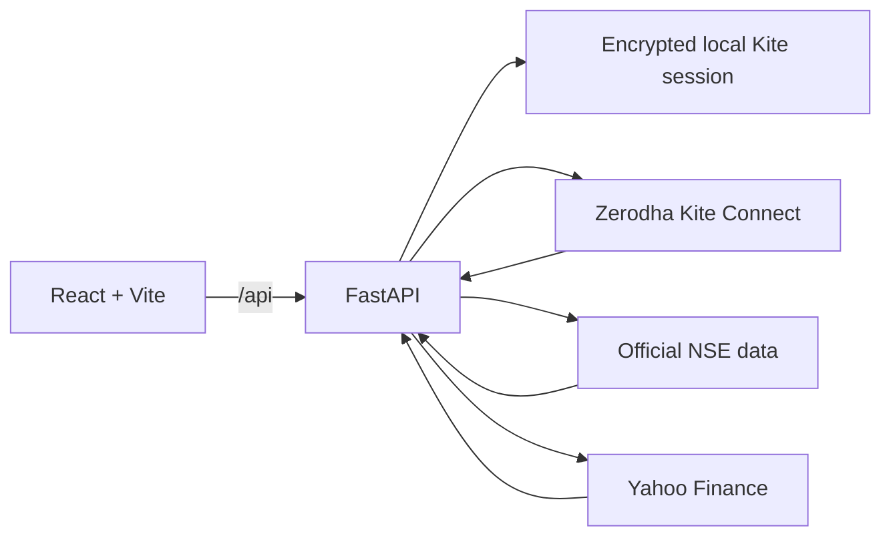

# Indian Market Intelligence Dashboard

**A portfolio data product by Ankit Kumar**

A local React and FastAPI dashboard that combines Zerodha Kite, official NSE datasets, and Yahoo Finance for Indian-market overview, Nifty 100 signal screening, and single-stock analysis.


> This application supports research and learning. It does not place orders or provide investment advice.

## Product preview

### Market overview


Full-page view of live and latest-session index direction, market movers, sector breadth, commodities, currencies, and open IPOs.

### Nifty 100 signals


The screenshot shows a completed Nifty 100 scan with 100 instruments ranked by their latest bullish or bearish SMA crossover.

### Stock analysis


Full-page RELIANCE analysis with price and volume, timeline controls, technical indicators, delivery participation, and fundamentals.

The [portfolio case study](docs/PORTFOLIO_CASE_STUDY.md) explains the product problem, architecture, analytics, engineering decisions, and results. The [build flow](docs/BUILD_FLOW.md) turns the implementation into a reusable guide for future data products.

## What the product does

- **User** — validates the saved Kite session and shows the authenticated profile, products, and exchanges.
- **Overview** — presents index trends, market direction, Nifty 100 gainers and losers, a sector heatmap, commodities, currencies, and open IPOs.
- **Signals** — scans the official Nifty 100 universe for configurable short/long SMA crossovers and ranks the latest signals.
- **Stock View** — searches a Nifty 100 stock and combines price/volume history, RSI, moving averages, MACD, ATR, delivery participation, and available fundamentals.

## Architecture



The backend is the trusted boundary. It performs the Kite token exchange, stores the access token locally, joins provider data, calculates indicators, and returns display-ready JSON. The access token is never returned to the browser.

## Technology

| Layer | Tools |
|---|---|
| Frontend | React 19, Vite 7, ECharts |
| Backend | Python, FastAPI, Uvicorn, pandas |
| Broker data | Zerodha Kite Connect Python SDK |
| Exchange data | Nifty Indices constituents and NSE archives |
| Fundamentals | Yahoo Finance through `yfinance` |
| Local security | Windows DPAPI encrypted session file |

## Run locally on Windows

### Fastest start

Double-click:

```text
Start Dashboard.cmd
```

The launcher starts the FastAPI backend and Vite frontend in hidden windows, then opens `http://127.0.0.1:5173/`.

### First-time setup

Open two PowerShell terminals in the project directory.

Backend:

```powershell
cd backend
python -m venv .venv
.\.venv\Scripts\python.exe -m pip install -r requirements.txt
.\.venv\Scripts\python.exe -m uvicorn main:app --host 127.0.0.1 --port 8000 --reload
```

Frontend:

```powershell
cd frontend
npm.cmd install
npm.cmd run dev
```

Open [http://127.0.0.1:5173/](http://127.0.0.1:5173/). API documentation is available at [http://127.0.0.1:8000/docs](http://127.0.0.1:8000/docs).

## Connect Zerodha Kite

1. Enter the Kite API key and API secret in the local login page.
2. Select **Authorize on Kite** and complete the broker login.
3. Copy the `request_token` query parameter from the redirect URL.
4. Paste the fresh request token into the local form and select **Login**.
5. The dashboard exchanges the request token and opens the User tab.

Request tokens are short-lived and single-use. Kite access tokens expire according to the broker session lifecycle and then require fresh authorization.

The backend stores only the API key and access token in an encrypted file at `%LOCALAPPDATA%\NiftyDashboard\kite-session.bin`. Browser storage and frontend source never receive the access token. **Sign out** removes the saved local session.

## Feature details

### Overview

The Overview tab refreshes quote snapshots while open. It includes:

- Index cards with rolling sparklines, hover values, completed-session date, and calculated percentage change.
- A configurable market-direction chart.
- Top-ten Nifty 100 gainers and losers.
- An expandable Nifty 100 sector treemap where area represents traded value and color represents change from previous close.
- Seven-session commodity and currency trends with hover price points.
- Current open IPOs with closing dates.

When closed-market quote snapshots do not include a dependable previous close or exchange timestamp, the backend uses official completed-session data rather than returning false zero changes or epoch dates.

Configuration is in `config/dashboard.json`. Overview code is in `backend/overview.py` and `frontend/src/Overview.jsx`.

### Signals

The scanner:

1. Loads the official Nifty 100 constituents.
2. Maps symbols to Kite NSE instrument tokens.
3. Fetches daily candles with warm-up history.
4. Calculates the selected short and long simple moving averages.
5. Detects the newest bullish or bearish crossover.
6. Ranks results by crossover date, newest first.

Default inputs are SMA 6, SMA 30, a 730-calendar-day lookback, and 100 stocks. Today's partial candle is excluded. Results represent the crossover session price and averages rather than the current quote.

Scanner code is in `backend/signals.py`; UI code is in `frontend/src/Signals.jsx`.

### Stock View

Stock View provides:

- Nifty 100 search and selection.
- Candlestick and volume history with 1M, 3M, 6M, YTD, 1Y, 3Y, 5Y, and maximum ranges.
- RSI 14, SMA 10/20/50/100, MACD 12/26/9, ATR 14, and a rules-based verdict.
- Seven completed sessions of total traded volume versus delivery volume from official NSE archives.
- Market cap, trailing P/E, P/B, debt-to-equity, ROE, EPS, dividend yield, and book value when dependable source values are available.

Changing the timeline requests only the price-chart series, so the rest of the page remains mounted. Missing fundamentals stay blank rather than being estimated without source data.

Stock code is in `backend/stock.py`; UI code is in `frontend/src/StockView.jsx`.

## Validation

Backend:

```powershell
cd backend
.\.venv\Scripts\python.exe -m pytest
```

Frontend:

```powershell
cd frontend
npm.cmd run build
```

The backend tests use mocked provider responses and temporary encrypted files. They do not place trades or require a live account request.

## Customize

- `config/dashboard.json` — refresh rate, indices, labels, and macro instruments.
- `frontend/src/styles.css` — theme tokens, typography, spacing, and responsive rules.
- `frontend/src/expanded.css` — heatmap and Stock View layouts.
- `frontend/src/main.jsx` — app shell, authentication, and tab order.
- `backend/main.py` — authentication, saved session, and route wiring.

## Data and security notes

- Kite historical data availability depends on the connected subscription.
- Yahoo Finance coverage can vary by NSE company and may be delayed or temporarily rate-limited.
- Commodity futures and FX values can use different units and market sessions from NSE cash equities.
- This is a single-user, loopback-only application. Keep both services bound to `127.0.0.1`.
- Do not commit `credentials.txt`, environment files, access tokens, runtime logs, virtual environments, or `node_modules`.

Read [Security and Repository Hygiene](docs/SECURITY.md) before publishing the repository.

## Repository map

```text
backend/                   FastAPI APIs, providers, calculations, and tests
frontend/                  React interface and visualizations
config/                    Dashboard and market-calendar configuration
docs/                      Case study, build guide, security notes, screenshots
Start Dashboard.cmd        One-click Windows launcher
Start Dashboard.ps1        Launcher implementation
nifty100_constituents.csv  Local Nifty 100 universe snapshot
```

## Portfolio documentation

- [Full case study](docs/PORTFOLIO_CASE_STUDY.md)
- [How to build this type of dashboard](docs/BUILD_FLOW.md)
- [Screenshot checklist](docs/screenshots/README.md)
- [Security checklist](docs/SECURITY.md)

