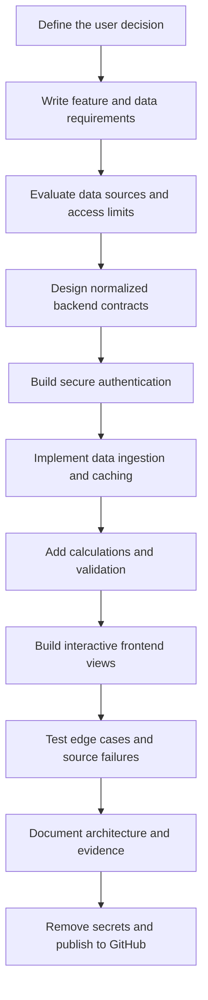
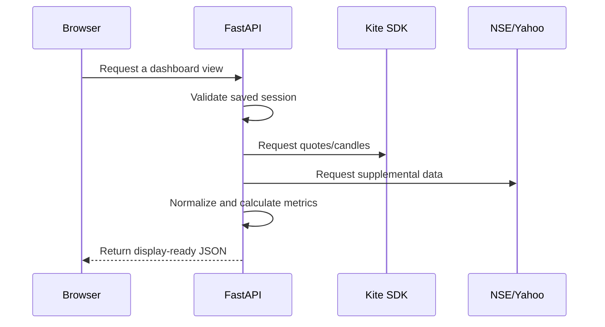

# Build Flow — From Idea to Market Dashboard

This guide explains how to build a data product like the Indian Market Intelligence Dashboard. It focuses on the order of decisions and implementation, so it can be reused for future portfolio projects.

## End-to-end flow



## 1. Start with the user decision

Avoid beginning with a chart or an API. Define what the user should be able to decide after using the product.

For this dashboard, the core decisions were:

- What is the current direction of the Indian market?
- Which Nifty 100 stocks have the newest SMA crossover?
- What do price, momentum, volume, delivery, and fundamentals say about one stock?

This framing determines which data is necessary and which interface elements deserve space.

## 2. Convert the workflow into product requirements

Divide the workflow into focused pages or tabs. For each page, write:

- The question it answers.
- The data fields required.
- The refresh frequency.
- The source and fallback.
- The expected empty and error states.

Example:

| View | Question | Main inputs | Output |
|---|---|---|---|
| Overview | What is moving the market? | Index quotes, prior close, constituents, traded value | Trends, movers, sector heatmap |
| Signals | Where did trend direction change? | Daily closes, short and long periods | Ranked crossover table |
| Stock View | What is the setup for one stock? | Candles, quotes, delivery archive, fundamentals | Interactive research page |

## 3. Evaluate data sources before coding

Create a source matrix and verify access, coverage, delay, licensing, and failure behavior.

For this project:

- Kite supplies authenticated quotes, instruments, and candles.
- Official NSE files supply the index universe and completed-session archive data.
- Yahoo Finance fills selected company-fundamental fields.

Do not assume one provider covers every metric. Decide which source owns each field and what the interface should show when it is missing.

## 4. Design the application boundary

Use the backend as the trusted data boundary. The frontend should call simple product-level endpoints rather than calling financial providers directly.



This design keeps provider credentials out of the browser and prevents frontend components from depending on vendor-specific formats.

## 5. Scaffold the services

Create two clearly separated applications:

```text
backend/
  main.py
  overview.py
  signals.py
  stock.py
  requirements.txt
  tests/

frontend/
  src/
  package.json
  vite.config.js
```

Recommended responsibilities:

- `main.py` — authentication, session handling, common endpoints, and router wiring.
- `overview.py` — market-summary and heatmap data.
- `signals.py` — constituent loading, token mapping, candles, and crossover logic.
- `stock.py` — search, history, technicals, delivery data, and fundamentals.
- React components — interaction and presentation only.

## 6. Implement secure Kite authentication

The Kite login lifecycle is:

1. Create a Kite Connect app and obtain the API key and secret.
2. Open the Kite login URL and authenticate with Zerodha.
3. Read the short-lived request token from the redirect URL.
4. Submit the API key, secret, and request token to FastAPI.
5. Use the Kite SDK to generate an access token.
6. Store the session only on the backend.
7. Return success and profile data, never the access token.

The saved session allows local code changes without repeated login until the broker invalidates or expires the token.

## 7. Normalize instruments and identifiers

Market providers use different symbol formats. Build one mapping layer:

```text
Nifty symbol -> NSE trading symbol -> Kite instrument token -> Yahoo ticker
```

Normalize names once in the backend. Add explicit handling for renamed symbols, special characters, and instruments that cannot be mapped.

## 8. Build each data pipeline independently

### Overview pipeline

1. Load configured index and macro instruments.
2. Request live quotes and rolling history.
3. Determine the latest completed session.
4. Calculate absolute and percentage change from the dependable previous close.
5. Load Nifty 100 constituents and sector classification.
6. Calculate each heatmap tile's size and color value.
7. Return a single overview response.

### Signals pipeline

1. Download the official Nifty 100 constituent CSV.
2. Map symbols to Kite NSE instrument tokens.
3. Fetch enough daily candles for the requested long SMA and lookback.
4. Calculate short and long rolling means.
5. Detect the most recent sign change between the two series.
6. Rank results by crossover date.
7. Return results and optionally export CSV.

### Stock pipeline

1. Search the instrument catalogue.
2. Fetch candles only for the selected chart timeline.
3. Calculate RSI and moving averages.
4. Load official delivery-volume data for the last completed sessions.
5. Combine the Kite price with available Yahoo Finance fundamentals.
6. Return independent response sections so one source failure does not erase the entire page.

## 9. Add caching intentionally

Cache stable or expensive data for an appropriate duration:

- Instrument master: long cache.
- Nifty constituents and sector classification: daily cache.
- Historical candles: short cache during development.
- Quotes: very short cache.
- Fundamentals: longer cache than market prices.

Cache keys should include the symbol, interval, and date range. Always provide a way to expire stale session data.

## 10. Build the interface around tasks

Use a consistent design system for color, typography, spacing, cards, tables, and loading states.

Interaction rules used in this product:

- Keep the tab order aligned with the user's workflow: User, Overview, Signals, Stock View.
- Use green and red consistently for positive and negative change.
- Show the date or session represented by every market card.
- Let chart timeline controls update the chart only.
- Show useful empty states when a source does not return a value.
- Provide hover values on compact trend lines.

## 11. Test calculations and edge cases

Financial dashboards can look correct while carrying wrong calculations. Test the transformations, not only the HTTP status.

Useful tests include:

- Percentage change from current and previous close.
- Bullish and bearish crossover boundaries.
- Insufficient candle history.
- Missing instrument mapping.
- Expired Kite session.
- Closed-market and holiday behavior.
- Missing Yahoo Finance values.
- Delivery percentage calculations.

Then build the frontend in production mode to catch bundling and type/import errors.

## 12. Capture portfolio evidence

Use a clean authenticated local session and capture:

1. The Overview tab showing index trends and the heatmap.
2. The Signals tab showing scanner controls and ranked results.
3. The Stock View showing the chart, technicals, delivery data, and fundamentals.

Do not include login credentials, access tokens, request tokens, account balances, or personally sensitive profile data in screenshots.

## 13. Prepare the repository for GitHub

Before the first commit:

- Confirm `.gitignore` excludes credentials, environments, `node_modules`, logs, caches, generated exports, and session files.
- Search the entire repository for API keys, secrets, request tokens, and access tokens.
- Keep an example configuration file with placeholder values when needed.
- Verify the setup instructions on a clean shell.
- Run backend tests and the frontend production build.
- Confirm every image and internal Markdown link resolves.

Suggested commands after creating an empty GitHub repository:

```powershell
git init
git add .
git status
git commit -m "Add Indian market intelligence dashboard"
git branch -M main
git remote add origin https://github.com/YOUR-USER/YOUR-REPOSITORY.git
git push -u origin main
```

Inspect `git status` before committing. If `credentials.txt`, session data, or logs appear, stop and fix `.gitignore` first.

## 14. Present the project in a portfolio

A concise portfolio entry can use this format:

> **Indian Market Intelligence Dashboard** — Designed and built a local React and FastAPI analytics product that combines Zerodha Kite, official NSE datasets, and Yahoo Finance. The dashboard covers market breadth, SMA crossover screening, interactive stock analysis, delivery volume, and company fundamentals while keeping broker tokens on the backend.

Include the repository link, two or three screenshots, the problem, your role, the main technical decision, and one example of a bug or data-quality issue you solved.
