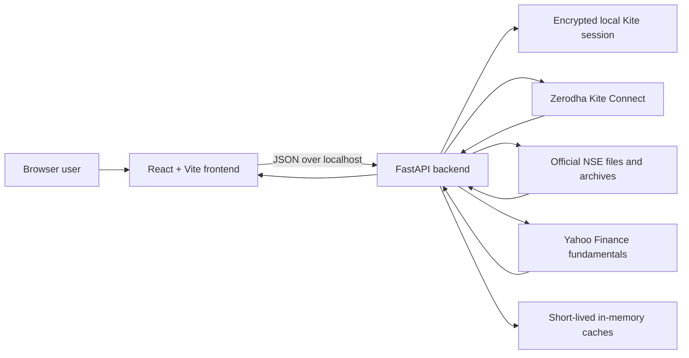

# Indian Market Intelligence Dashboard — Portfolio Case Study

## Project summary

This project is a local market-analysis product for Indian equities. It combines Zerodha Kite market data, official NSE datasets, and Yahoo Finance fundamentals in one dashboard for daily market review, technical screening, and single-stock analysis.

The product was designed and built by **Ankit Kumar** as a portfolio project demonstrating product thinking, data integration, backend API design, financial analytics, and frontend data visualization.

> The application is an analytical tool. It does not place orders or provide investment advice.

## The problem

Market research often requires switching among a broker terminal, index pages, screeners, spreadsheets, and company-information sites. That makes a repeatable daily workflow slow and makes it hard to connect broad market direction with stock-level signals.

The dashboard brings four workflows into one interface:

1. Authenticate securely with Zerodha Kite and inspect the active user profile.
2. Review index direction, market movers, sector breadth, macro instruments, and open IPOs.
3. Scan the Nifty 100 for recent SMA crossovers.
4. Search an individual stock and examine its price, volume, technical indicators, delivery activity, and fundamentals.

## Product outcome

The result is a locally hosted React and FastAPI application with four focused tabs:

- **User** — displays the authenticated Kite profile and supported products/exchanges.
- **Overview** — summarizes index trends, market direction, gainers and losers, the Nifty 100 heatmap, commodities, currencies, and open IPOs.
- **Signals** — runs a configurable Nifty 100 SMA crossover scan and ranks the latest signals.
- **Stock View** — provides symbol search, interactive price and volume history, swing-trading indicators, delivery-volume analysis, and company fundamentals.

## Product screenshots

Dashboard screenshots are stored in [`docs/screenshots`](screenshots/README.md). They are captured from an authenticated local session without login credentials, account tokens, or sensitive profile information.

### Market overview


The Overview tab combines latest-session index trends, market direction, Nifty 100 movers, sector breadth, macro instruments, and open IPOs.

### Nifty 100 signals


The Signals tab ranks Nifty 100 companies by their most recent bullish or bearish SMA crossover.

### Stock analysis


The full Stock View screenshot shows RELIANCE price and volume history, interactive timeline controls, technical indicators, delivery-volume analysis, and company fundamentals.

## Architecture



The browser never receives the Kite access token. Login credentials are submitted to the backend, the SDK exchanges the request token for an access token, and the backend stores the session locally in encrypted form. Subsequent frontend requests use the saved server-side session.

## Data sources and responsibilities

| Source | Used for | Why it was selected |
|---|---|---|
| Zerodha Kite Connect | Profile, instruments, live quotes, historical candles | Authenticated broker data and official Python SDK |
| NSE Indices / NSE archive | Nifty 100 constituents, completed-session delivery data, closed-market fallback | Official exchange and index datasets |
| Yahoo Finance | Company fundamentals when available | Broad public coverage for valuation and balance-sheet fields |
| Local configuration | Dashboard instruments, labels, and display settings | Makes the interface easier to customize without editing components |

## Key analytics

### SMA crossover scanner

For each mapped Nifty 100 instrument, the backend downloads daily candles and calculates two rolling simple moving averages:

```text
SMA(n) = sum of the latest n closing prices / n
```

A bullish crossover occurs when the short SMA moves from at or below the long SMA to above it. A bearish crossover is the opposite transition. Results are ordered by crossover date, most recent first.

### Market overview

Index cards use a rolling trend series and calculate session change from the latest completed market session. During closed-market periods, the backend uses official completed-session data where the quote snapshot does not contain a dependable previous close. This avoids false `0.00%` changes and epoch-style dates.

The Nifty 100 heatmap groups companies by sector. Tile size represents traded value, and color represents percentage change from the prior close. This lets the user see both market impact and direction at a glance.

### Stock analysis

The stock view combines:

- Price and volume history with independent timeline controls.
- RSI and bullish/bearish interpretation.
- Moving averages for 10, 20, 50, and 100 sessions.
- Seven-session traded volume versus delivery volume.
- Market cap, P/E, P/B, debt-to-equity, ROE, EPS, dividend yield, and book value when source data is available.

Timeline changes update only the price chart request and do not reload the entire stock page.

## Engineering decisions

### Keep secrets on the server

The access token is never returned to React or written to browser storage. Credentials and local session artifacts are excluded from Git through `.gitignore`.

### Normalize different sources in FastAPI

Kite, NSE, and Yahoo Finance use different identifiers and response shapes. The backend maps them into stable response models, allowing the frontend to focus on rendering and interaction.

### Prefer truthful missing values

Financial fields remain blank when a source does not provide a dependable value. The product does not fabricate metrics simply to fill a card.

### Design for a local workflow

The project includes a Windows launcher that starts the backend and frontend and opens the dashboard. This keeps the development experience accessible for a beginner while preserving a clean separation between services.

## Reliability and validation

The project includes backend tests for authentication behavior, market calculations, signals, and stock data. The frontend is validated through a production Vite build.

Current verification target:

```powershell
cd backend
.\.venv\Scripts\python.exe -m pytest

cd ..\frontend
npm run build
```

At the time this case study was prepared, the backend suite contained 15 passing tests and the frontend production build completed successfully.

## Skills demonstrated

- Translating product requirements into a multi-tab analytical workflow.
- Integrating authenticated and public financial-data sources.
- Designing FastAPI endpoints and React visualization components.
- Working with instrument-token mapping and time-series calculations.
- Handling market-calendar, stale-session, and missing-data edge cases.
- Protecting credentials and access tokens in a local application.
- Testing data transformations and building a repeatable local startup flow.

## Limitations

- Kite access tokens expire and require a fresh authorization flow according to the broker session lifecycle.
- Some fundamental fields can be unavailable or delayed because Yahoo Finance is an unofficial data source.
- NSE archive availability and file formats can change.
- The dashboard is intended for local analysis and has not been hardened for public multi-user hosting.

## Next iterations

- Add a persistent analytical database for historical snapshots.
- Track signal performance after each crossover.
- Add watchlists and saved scanner presets.
- Add scheduled data refresh with market-calendar awareness.
- Add containerized deployment and continuous integration.
- Add accessibility and browser-level end-to-end tests.

For the implementation sequence, see [Build Flow](BUILD_FLOW.md). For repository hygiene, see [Security](SECURITY.md).

